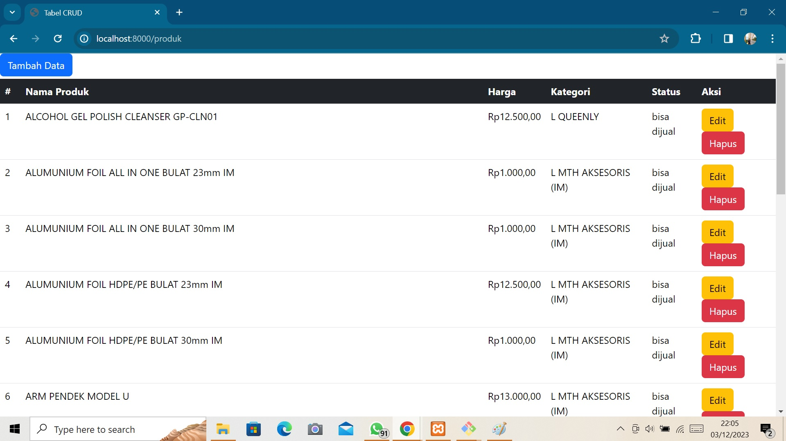

# Tes Junior Programmer Fast Print
## By Muhamad Zakaria Saputra


## Penggunaan
Anda harus menginstall terlebih dahulu Composer yang bisa anda download disini:<br>
https://getcomposer.org/download/
<br><br>
Aktifkan terlebih dahulu MySQL menggunakan XAMPP<br>
Lalu jalankan perintah:
```bash
composer install
php artisan migrate
php artisan db:seed --class=KategoriSeeder
php artisan db:seed --class=StatusSeeder
php artisan serve
```
Secara default aplikasi akan berjalan pada URL http://localhost:8000

## Dokumentasi
Tabel produk berada pada '/produk'<br>
Jadi, setelah anda selesai menjalankan perintah diatas, salinlah URL yang tertera di terminal<br>
(Secara default URL adalah http://localhost:8000)<br>
Lalu, tambahkan '/produk' di belakang URL tersebut (Contoh: http://localhost:8000/produk)<br>
Dan anda akan disuguhkan dengan halaman sebagai berikut:

<br><br>
Tabel ini hanya menampilkan produk yang berstatus 'bisa dijual'<br>
Anda bisa menambah, mengedit, dan menghapus data dengan mengklik tombol tombol yang tertera.<br>

## Penjelasan Cara Kerja
Ketika pertama kali diinstall, aplikasi ini akan mengisi tabel 'kategori' dan 'status' dengan value yang telah ditentukan. Lalu ketika anda masuk ke halaman tabel, aplikasi ini akan mengecek apakah tabel 'produk' kosong atau tidak, jika kosong maka secara otomatis aplikasi ini akan mengambil data dari API https://recruitment.fastprint.co.id/tes/api_tes_programmer<br>
dan secara otomatis menyimpannya di tabel 'produk'.<br>
